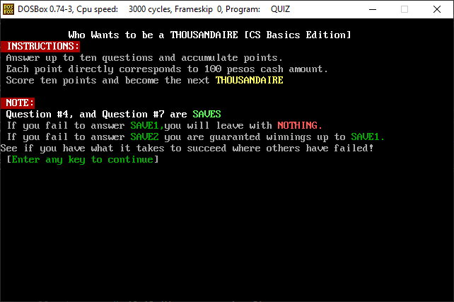
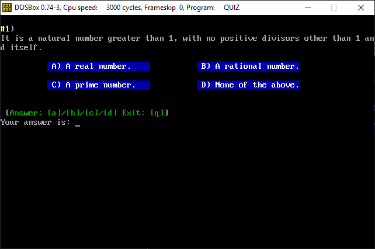
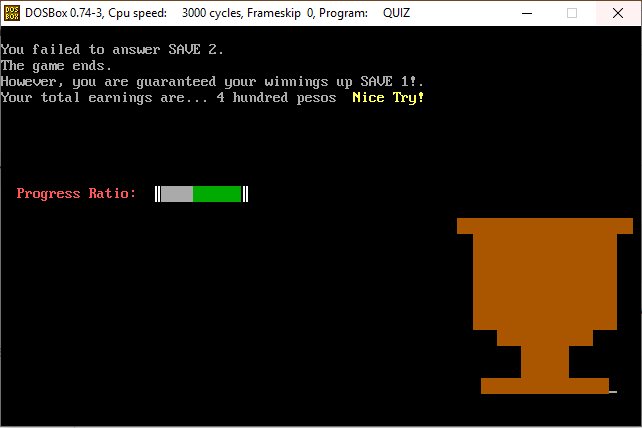

# Thousandaire

## High Concept Statement

> The Thousandaire quiz game borrows the safe havens mechanic of the game 'who wants to be a millionaire' in which, points earned per question are at risk of being disposed of unless the reach specific milestones. The game was developed in assembly.

## GAMEPLAY:

In this case, **the milestones are question number 4 and number 7**.
The minimum possible points reach the final questions is therefore 2.
If you lose the fourth question, you leave the game with zero points, even if you answered correctly before this. Answering #4 correctly means any previously accumulated points get saved.

There are 10 questions in total, all in the topic of basic discrete mathematics and computer science algorithms.

Correct answers are marked via comment in the code.

- The code makes use of the **.386 assembly directive** that allows X86 type code jumps; eliminating the nuisance of the -127/+127 jumps permitted by default.

- The argument **USE16** is a DOSBOX specific parameter than allows one to use both 36 bit conditions in a 16/8bit environment. As such, I did not have to resort to using the e-[ax] registers. The caveat here is that this is a command that can only work with the DOSBOX emulator environment; using the physical implementation, it will no doubt work differently.

- Due to the nature of handling video modes in the DOSBOX emulator, certain graphics may appear distorted if the emulator is run beside a graphics accelerated program. However, merely re-running the .exe again will fix these issues, should they arise.

- The game makes use of blinking text, as such, these pictures are not entirely representative of the final product. (It was used to denote progress via the progress bar, or alert the user of the current question's index)

